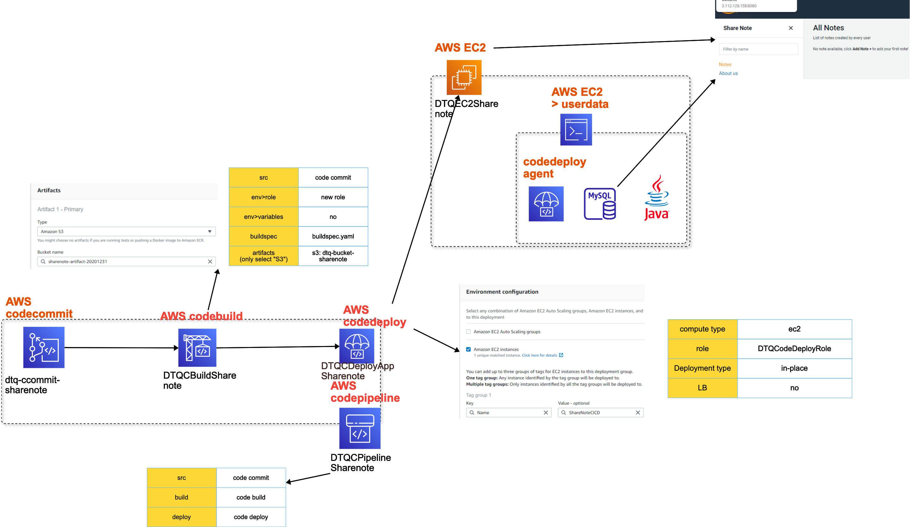
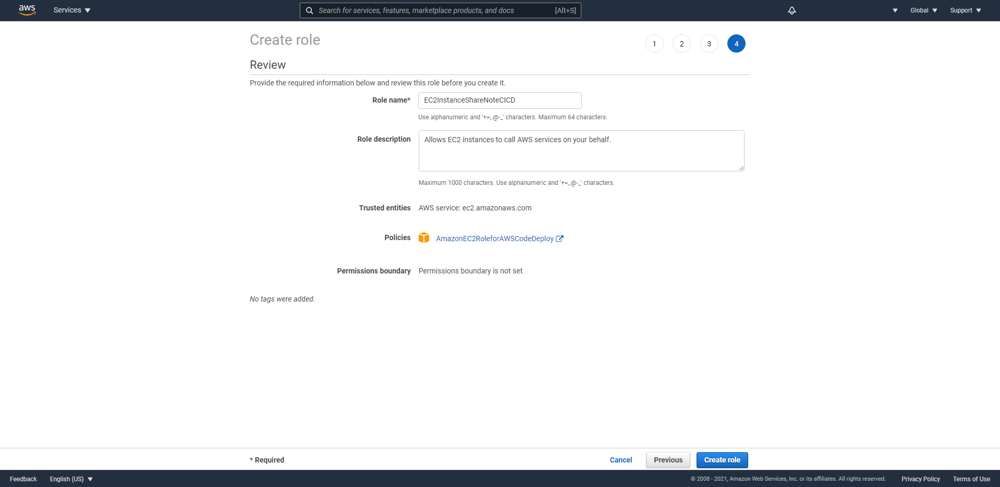
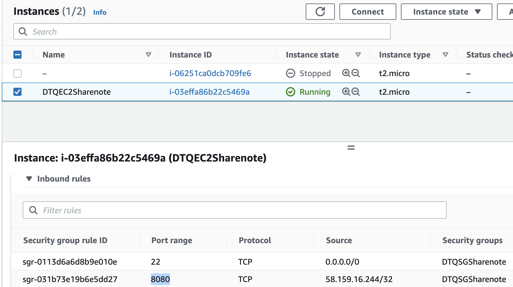
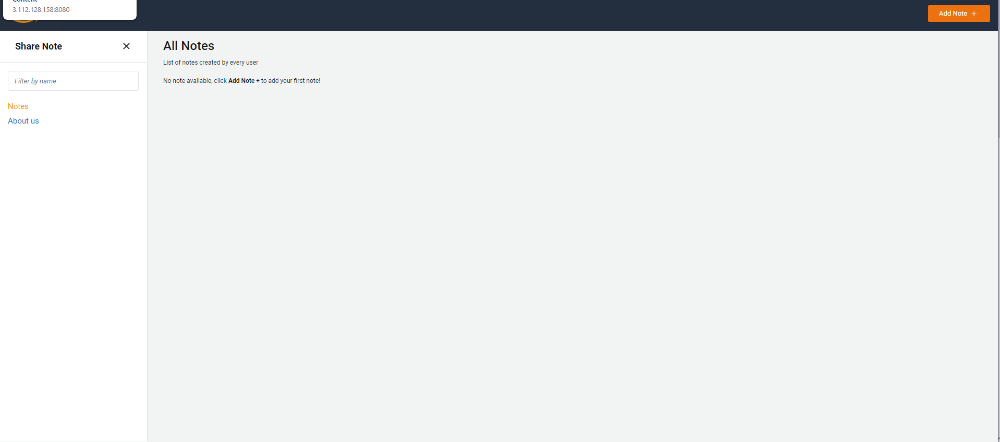

# aws-cicd-userdata-script-sharenote 🐳


[](https://github.com/tquangdo/aws-cicd-userdata-script-sharenote/issues/new)



## reference
[awsstudygroup](https://000023.awsstudygroup.com/vi)

## role
- need `S3FullAccess` (this screenshot is NOT enough!!!)


## EC2
1. ### SG
  - need `8080` inbound rule!!!
  

## CodeDeploy Agent
- if ERR in CICD, SSH to EC2 and check by these CMD:
```shell
sudo service codedeploy-agent status
sudo systemctl restart codedeploy-agent.service
systemctl status codedeploy-agent.service
tail -f /var/log/aws/codedeploy-agent/codedeploy-agent.log
# =>
# 2022-02-19 17:31:28 INFO  [codedeploy-agent(14531)]: Version file found in /opt/codedeploy-agent/.version with agent version OFFICIAL_1.3.2-1902_rpm.
tail -f /var/log/aws/codedeploy-agent/codedeploy-agent.log | grep -e ERROR -e WARN
# => blank!
```

## final result
- access `http://<public IPv4 DNS of EC2>:8080` on browser 💣💣!!!


## delete AWS resources
`./del_aws_resource.sh`